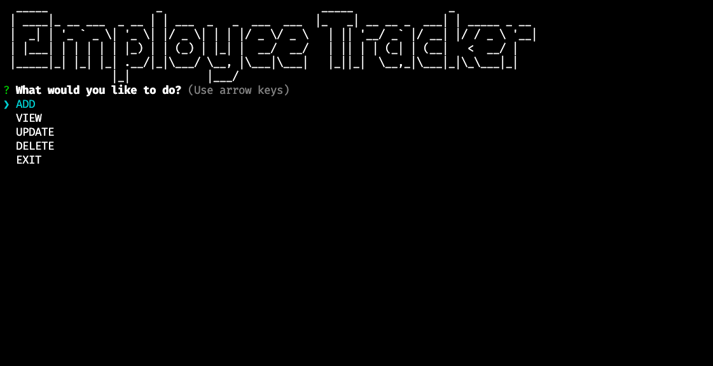
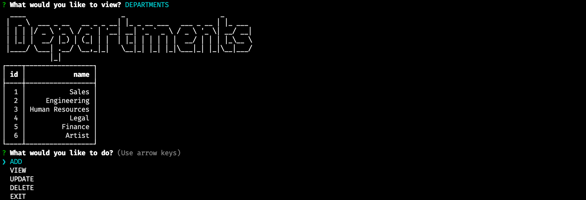

# Employee Tracker

  

  ## Description

  Command line content management system
  
  Click the link below to visit my deployed page.

  https://youtu.be/itDD6llxDMM
  <!-- [URL](undefined) -->
  

  ## Table of Contents
  
  * [Goals](#goals)

  * [Usage](#usage) 

  * [Installation](#installation)  

  * [Test](#test)

  * [Problems](#problems)

  * [Visualization](#visualization)

  * [Acknowledgements](#acknowledgements)

  * [Contributions](#contributions)

  * [Resources](#resources)

  * [License](#license) 

  * [Contact](#contact) 

  
  ## Goals

  Build a command line content management system from scratch to access, modify and delete data from a database

  ## Motivation

  Business owners need to be able to view the various aspects of their labor force in order to properly organize and plan their business.  This application solves many of those concerns. 

  ## Usage

  This application is meant to be accessed from the command line.  It allows adding, viewing, updating or deleting  of employees, roles and departments

  ## Installation
  
  npm -i   followed by   node index.js  

  ## Test

  N/A

  ## Problems

  I had difficulties getting the JavaScript and SQL working together. It was definitely a challenge that I was glad to have worked through and learned from.

  ## Visualization

  

  
  

  ## Acknowledgements

  Fenix Sampson

  ## Contributions

  Email me or submit a pull request

  ## Resources
 
  The project was built using node.js as well as the following npm packages all acquired from npmjs.com:  MySQL, MySQL2, Figlet, Inquirer, Sequelize and Dotenv

  ## License

  

  This projet uses MIT. 
  
  The link to the License can be found here (https://opensource.org/licenses/MIT)

  ## Contact
  
  GitHub Username: FenixS83 [@FenixS83](https://github.com/FenixS83)

  fenix.sampson@gmail.com

